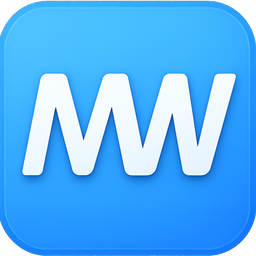

# WordMarker (我的马克)

WordMarker 是一款专注于将 Markdown 高效转换为完美排版 Word 文档的生产力工具。它旨在解决传统文档编辑中繁琐的格式调整痛点，让用户能够沉浸于内容创作，而后一键生成符合专业标准的文档交付物。

## 解决的核心问题

在日常办公与学术写作中，调整 Word 格式往往耗费大量精力，且难以保持一致性。WordMarker 允许用户使用简洁的 Markdown 语法进行写作，随后通过智能转换引擎，自动应用预设的样式模板。这意味着您无需手动设置字体、段落间距或标题层级，即可获得排版严谨、美观大方的 Word 文档，极大提升了从草稿到最终成稿的效率。

## 视觉与交互设计

我们深知写作环境对思维的影响，因此精心打造了极简主义的现代界面。UI 设计摒弃了常见编辑器的复杂工具栏，采用清爽的无干扰布局，配合细腻的排版与护眼配色，为您提供沉浸式的写作体验。每一次按键与交互都经过细致打磨，确保在保持功能强大的同时，视觉上依然轻盈流畅，符合现代审美标准。

## 核心体验

软件内置了对复杂内容的完善支持，无论是学术公式还是代码片段，均能优雅呈现并精准转换。通过独特的参考文档机制，您可以轻松复用已有的 Word 格式标准，确保输出文档始终符合特定的排版要求。从新建草稿到导出分享，WordMarker 让文档处理流程变得简单而优雅。

## 支持我

> 如果您觉得 WordMarker 对您的工作有所帮助，欢迎通过以下方式支持我们的持续开发与优化。支持金额超过20元的用户，送激活码。

