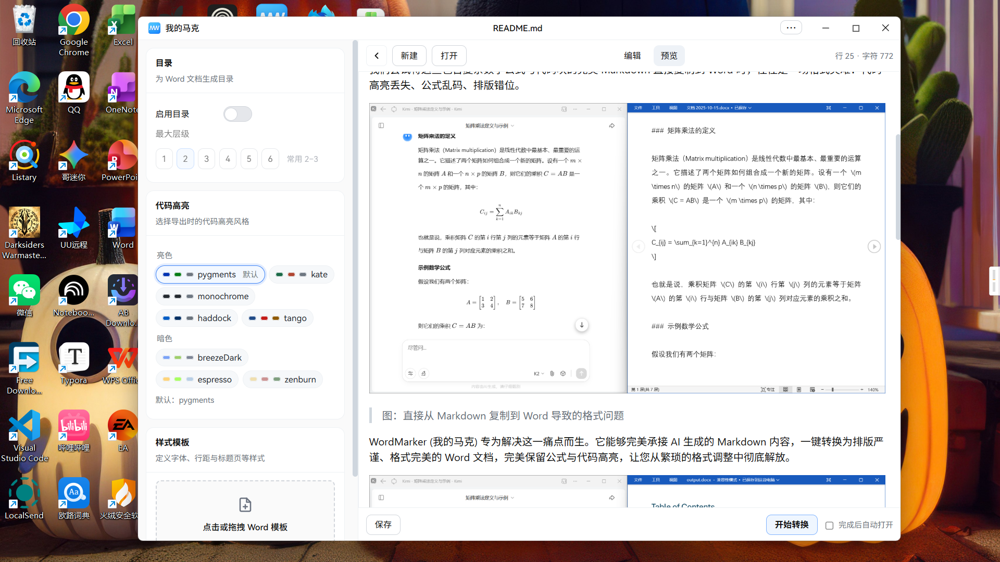

# 我的马克：AI 时代的文档排版利器

在 AIGC 成为主流的今天，我们习惯使用 ChatGPT、Claude 或 DeepSeek 高效生成Markdown 格式的内容。但当我们尝试将这些包含复杂数学公式与代码块的完美 Markdown 直接复制到 Word 时，往往是一场格式灾难：代码高亮丢失、公式乱码、排版错位。

> 图：直接从 Markdown 复制到 Word 导致的格式问题

WordMarker (我的马克) 专为解决这一痛点而生。它能够完美承接 AI 生成的 Markdown 内容，一键转换为排版严谨、格式完美的 Word 文档，完美保留公式与代码高亮，让您从繁琐的格式调整中彻底解放。

> 图：使用 WordMarker 将 Markdown 转换为格式完美的 Word 文档

## 视觉与交互设计

我们深知写作环境对思维的影响，因此精心打造了极简主义的现代界面。UI 设计摒弃了常见编辑器的复杂工具栏，采用清爽的无干扰布局，配合细腻的排版与护眼配色，为您提供沉浸式的写作体验。每一次按键与交互都经过细致打磨，确保在保持功能强大的同时，视觉上依然轻盈流畅，符合现代审美标准。

## 支持我

> 如果您觉得 WordMarker 对您的工作有所帮助，欢迎通过以下方式支持我们的持续开发与优化。

