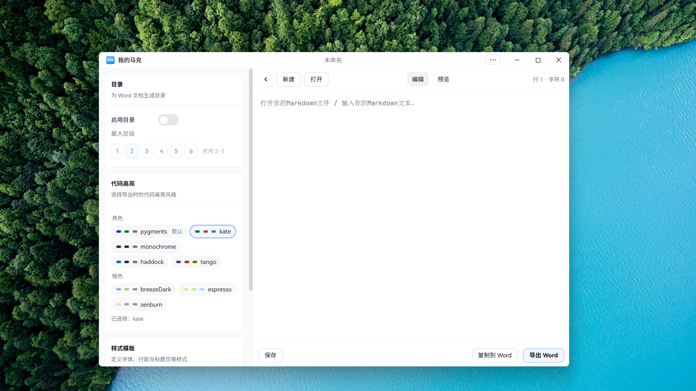
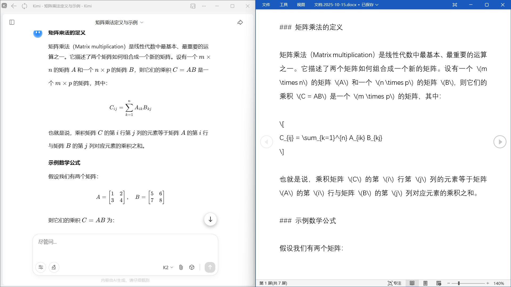
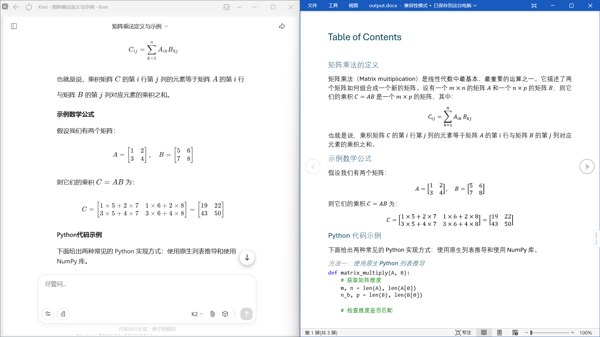
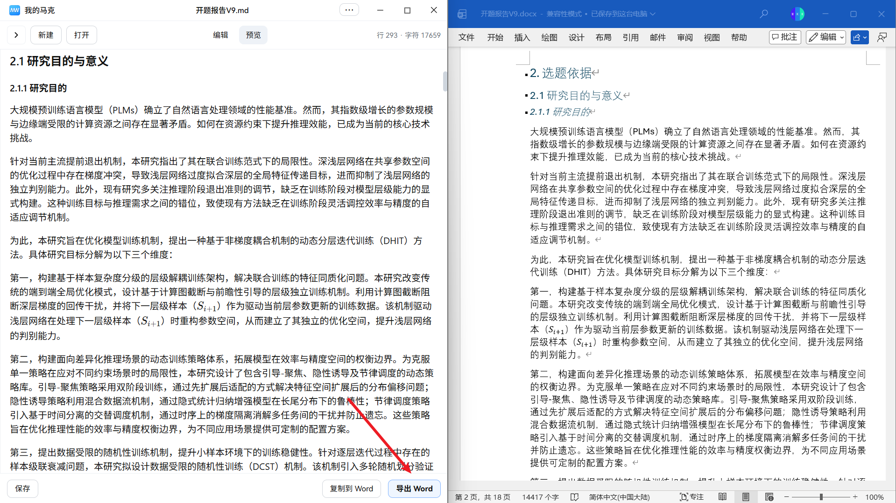

# 我的马克：将AI生成的内容转换为Word格式

---

目前 WordMarker2.0.0 已登录微软商店，Windows 平台的用户可以直接在微软商店搜索 [u]我的马克/WordMarker[/u] 进行下载。

如果不方便使用微软商店进行下载或者其它平台的用户可以直接使用下面的下载链接进行下载。

下载直链：[WordMarker V2.0.0](https://www.ilanzou.com/s/QmempsdV?code=2026)
> 注意：该链接不限速，也不需要登录。选择对应的平台下载即可。

---

完美兼容以下AI产品：

| AI 网站 | 数学公式 | 表格 | 代码 | 流程图 |
|---------|:----------------------------:|:----------------------------:|:---------------------------:|:---------------------------:|
| **Kimi** | ✅ 完美支持 | ✅ 完美支持 | ✅ 完美支持 | ✅ 完美支持 |
| **DeepSeek** | ✅ 完美支持 | ✅ 完美支持 | ✅ 完美支持 | ✅ 完美支持 |
| **通义千问** | ✅ 完美支持 | ✅ 完美支持 | ✅ 完美支持 | ✅ 完美支持 |
| **豆包** | ✅ 完美支持 | ✅ 完美支持 | ✅ 完美支持 | ✅ 完美支持 |
| **智谱清言** | ✅ 完美支持 | ✅ 完美支持 | ✅ 完美支持 | ✅ 完美支持 |
| **ChatGPT** | ✅ 完美支持 | ✅ 完美支持| ✅ 完美支持 | ✅ 完美支持 |
| **Gemini** | ✅ 完美支持 | ✅ 完美支持 | ✅ 完美支持 | ✅ 完美支持 |
| **Grok** | ✅ 完美支持 | ✅ 完美支持 | ✅ 完美支持 | ✅ 完美支持 |
| **Claude** | ✅ 完美支持 | ✅ 完美支持 | ✅ 完美支持 | ✅ 完美支持 |

---

[我的马克视频介绍](https://www.bilibili.com/video/BV1wwNgzhEac/?spm_id_from=333.1387.0.0)

[我的马克Github地址](https://github.com/CarrotWuDev/WordMarker)

[使用我的马克将通义千问生成的内容转换为Word格式](https://www.bilibili.com/video/BV1tYw2zPEHf/)

[使用我的ChatGPT生成的内容转换为Word格式](https://www.bilibili.com/video/BV1wsDCBXE6y)

[使用我的马克将豆包生成的内容转换为Word格式](https://www.bilibili.com/video/BV1aHXCBkEHp/)

---

WordMarker能够将AI生成的文本转换为Word格式，支持DeepSeek、豆包、千问、Kimi、ChatGPT、Gemini、Claude等国内外AI模型。是你在公文写作、论文写作、课程作业等场景的好助手。

直接复制AI生成的文本到Word中，并不会保留原有的格式，尤其是数学公式、表格、代码等内容，会变成一堆混乱的字符。如下图所示：

左边是Kimi AI生成的文本，直接复制到右边的Word中，标题样式和加粗样式并没有保留，数学公式也变成一堆混乱的字符。

但是在使用WordMarker转换后，标题样式、加粗样式、表格和数学公式都能完美保留，如下图所示：

WordMarker支持两种转换方式：直接复制和转换为文件。

对于短文本，比如和AI的某一次对话或者某个数学公式，萝卜哥推荐直接复制的方式，操作简单快捷。

对于长文本，比如论文、报告等，萝卜哥推荐转换为文件的方式。因为长文本直接复制可能会导致系统剪贴板奔溃，转换为文件的方式可以避免这个问题。

## 支持我

> 如果您觉得 WordMarker 对您的工作有所帮助，欢迎通过以下方式支持我们的持续开发与优化。

